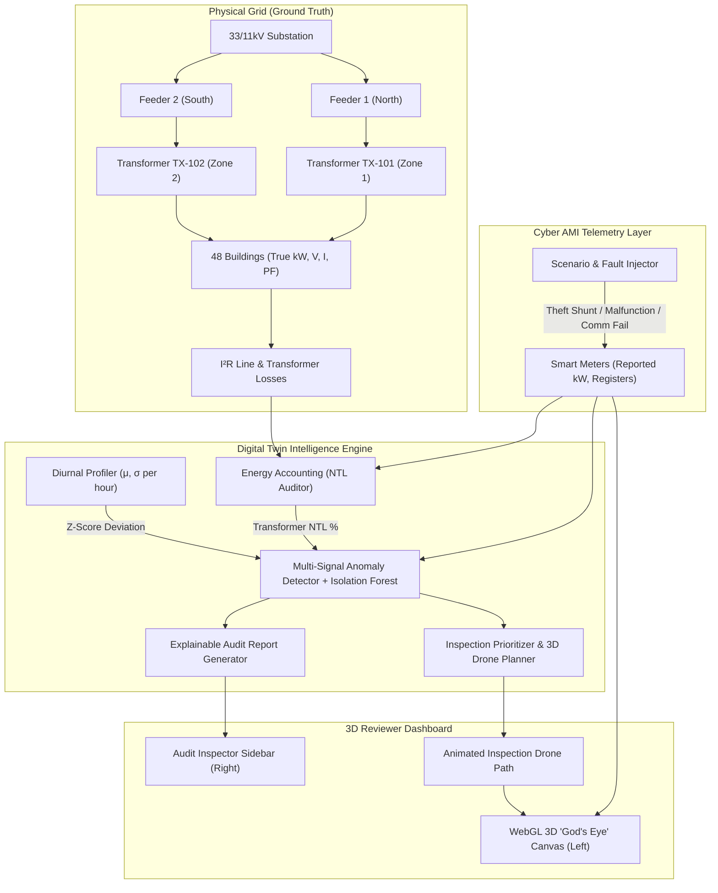

# Smart Grid Digital Twin: Cyber-Physical Anomaly Detection & Anti-Theft Platform

> **Problem Statement 2:** Advanced Anomaly Detection, Time-Series Analysis, Energy Accounting, and Digital Twinning for Electrical Power Distribution Networks.

---

## 1. Executive Summary & Core USP

Traditional threshold-based electricity monitoring triggers excessive false alarms due to seasonal changes, human behavioral shifts, or benign appliance bursts (such as EV charging). Conversely, sophisticated non-technical losses (electricity theft via meter shunts, bypasses, or magnetic tampering) often masquerade as low consumption.

This platform implements a **cyber-physical Digital Twin** of an urban/suburban electricity distribution network featuring:
- **Dual-State Cyber-Physical Modeling (The Core USP):**
  - **Ground Truth State:** Physical electricity actually flowing through wires and loads.
  - **Cyber Reported State:** Telemetry recorded and transmitted by the smart meter (subject to theft, tampering, hardware faults, and packet dropouts).
  - **Transformer Energy Accounting:** Cross-references bulk transformer intake against aggregate smart meter reporting, separating **Technical Losses ($I^2R$ copper + core loss)** from **Non-Technical Losses (Theft/Fraud)**.
  - **"Reveal Ground Truth" Toggle:** Allows auditors and judges to unmask hidden theft in real-time.
- **2-Zone 3D GIS Spatial Model:**
  - Zone 1: North Sector (Transformer `TX-101`, Feeder `FDR_NORTH_11KV`, 24 consumers)
  - Zone 2: South Sector (Transformer `TX-102`, Feeder `FDR_SOUTH_11KV`, 24 consumers)
  - Total 48 buildings with 3D extruded footprints, heights, utility poles, and service drop lines.
- **5 Realistic Operational Scenarios:**
  1. **Electricity Theft / Tampering:** Shunt bypass (reports 25%–35% of true load) or flat baseline fraud while ground truth stays high; triggers transformer-level NTL spikes.
  2. **Meter Malfunction:** Stuck energy registers, zero active current with normal terminal voltage (230V), or erratic sensor saturation (>6x contract load) with hardware diagnostic flags.
  3. **Communication Failure:** AMI packet drops, missing telemetry intervals, timeout flags; physical service drop remains energized.
  4. **Legitimate Abnormal Consumption:** Level-2 EV charging surge (+7.4 kW) or heatwave HVAC peaks; verified by matching transformer load increase with 0% unexplained loss.
  5. **Normal Diurnal Consumption:** Realistic human behavioral curves (morning and evening peaks, appliance cycles, stochastic noise).
- **Explainable Investigation Reports:** Plain-English technical rationales, multi-signal evidence chains, confidence scores, and tactical field recommendations.
- **Autonomous Drone / Field Inspection Planner:** Multi-criteria priority queue and 3D flight trajectory (takeoff, hover inspection, return) connecting high-priority flagged targets.
- **Interactive 3D WebGL "God's Eye" Viewer:** Translucent extruded glass buildings, glowing neon wireframes, pulse rings, and real-time inspector sidebar.

---

## 2. System Architecture



---

## 3. Directory Layout

```
smart_grid_digital_twin/
├── README.md                      # Complete system documentation
├── requirements.txt               # Pinned Python dependencies
├── config.py                      # Electrical specifications & grid thresholds
├── models/
│   ├── __init__.py
│   ├── topology.py                # NetworkX grid topology, Coordinates, Consumers, Transformers
│   ├── electrical.py              # AC electrical formulas, voltage drops, I^2*R & core losses
│   └── telemetry.py               # Dual-state models, TelemetryReading, MeterStatusFlags
├── simulation/
│   ├── __init__.py
│   ├── city_generator.py          # Procedural 3D GIS city cluster & 2 transformer zones
│   ├── load_profiles.py           # Diurnal human behavior load profiles & 14-day baseline builder
│   ├── scenario_injector.py       # Injectors for the 5 core operational scenarios
│   └── clock.py                   # Virtual simulation clock (15-min intervals, step/fast-forward)
├── engine/
│   ├── __init__.py
│   ├── digital_twin.py            # Master Digital Twin orchestrator
│   ├── energy_accounting.py       # Transformer energy balance & NTL loss auditor
│   ├── anomaly_detector.py        # Multi-signal fusion + Isolation Forest classifier
│   ├── explainer.py               # Auditable report generator with plain-English rationales
│   └── inspection_planner.py      # Field inspection priority ranking & 3D drone flight paths
├── export/
│   ├── __init__.py
│   ├── geojson_exporter.py        # Exports 3D buildings, electrical lines, and drone flight paths
│   └── report_exporter.py         # Exports Markdown/JSON investigation reports and CSV summaries
├── viewer/
│   └── twin_viewer.html           # Standalone interactive 3D WebGL / Three.js "God's Eye" Viewer
├── server/
│   ├── __init__.py
│   └── api.py                     # FastAPI + WebSocket streaming backend
├── tests/
│   ├── __init__.py
│   └── test_digital_twin.py       # 11 automated unit/integration tests
└── run_twin.py                    # Master CLI demo runner
```

---

## 4. Electrical Formulation & Loss Physics

### 4.1 AC Single-Phase Service Drop
For a consumer drawing active power $P$ (kW) with power factor $\cos \phi$:
$$\text{Line Current } I = \frac{P \times 1000}{V_{\text{terminal}} \times \cos \phi} \quad (\text{Amperes})$$
$$\text{Voltage Drop } \Delta V = I \cdot (R_{\text{cable}} \cos \phi + X_{\text{cable}} \sin \phi) \cdot d$$
$$V_{\text{terminal}} = V_{\text{trans}} - \Delta V$$
$$\text{Line Copper Loss } P_{\text{loss, line}} = \frac{I^2 \cdot (R_{\text{cable}} \cdot d)}{1000} \quad (\text{kW})$$

### 4.2 Distribution Transformer Losses
$$\text{Total Transformer Loss } P_{\text{tx}} = P_{\text{core}} + P_{\text{copper, rated}} \cdot \left(\frac{S_{\text{load}}}{S_{\text{rated}}}\right)^2$$
Where $P_{\text{core}} \approx 0.35\text{ kW}$ (no-load core magnetizing loss) and $P_{\text{copper, rated}} \approx 1.6\text{ kW}$ (winding resistive loss at 100 kVA).

### 4.3 Energy Accounting & Non-Technical Loss (NTL)
$$\text{Physical Transformer Intake } P_{\text{tx, in}} = \sum_{c \in \text{Zone}} P_{c, \text{true}} + \sum P_{\text{loss, line}} + P_{\text{tx}}$$
$$\text{Cyber Reported Load } P_{\text{reported, sum}} = \sum_{c \in \text{Zone, online}} P_{c, \text{reported}}$$
$$\text{Unexplained Loss (NTL)} = \max\left(0,\, P_{\text{tx, in}} - P_{\text{reported, sum}} - P_{\text{tech, estimated}}\right)$$
$$\text{NTL Percentage} = \frac{\text{NTL}}{P_{\text{tx, in}}} \times 100\%$$
*If $\text{NTL} > 8.0\%$, the transformer zone is immediately flagged as `SUSPICIOUS_NTL` or `CRITICAL_THEFT_CLUSTER`.*

---

## 5. Multi-Signal Anomaly Detection Engine

Rather than relying on a brittle single-metric threshold, the engine fuses five distinct signals:

| Signal | Mathematical Representation | Diagnostic Function |
|---|---|---|
| **Diurnal Baseline Deviation** | $z = \frac{P_{\text{reported}} - \mu_{\text{hour}}}{\sigma_{\text{hour}}}$ | Flags deviations from historical hour-of-day behavioral patterns |
| **Parent Transformer NTL** | $\text{NTL}_{\%} = \frac{\text{Discrepancy}}{P_{\text{tx}}} \times 100$ | Corroborates consumer drops with physical bulk energy leakage |
| **Peer Similarity Ratio** | $\rho = \frac{P_{c}}{\bar{P}_{\text{zone}}}$ | Identifies isolated drops relative to neighbors on the same feeder |
| **Hardware Diagnostic Flags** | 8-bit status mask (`hardware_fault`, `magnetic_tamper`, `tamper_cover_opened`, `reverse_current`) | Directly identifies physical tampering or transducer failure |
| **Isolation Forest ML** | Outlier decision function on 5D feature vector | Detects subtle multivariate deviations in unflagged regimes |

---

## 6. How to Run the Digital Twin

### 6.1 Run Automated Test Suite (100% Passing)
```bash
cd smart_grid_digital_twin
.\.venv\Scripts\python.exe -m unittest tests/test_digital_twin.py
```

### 6.2 Run Command-Line Simulation & Report Exporter
```bash
.\.venv\Scripts\python.exe run_twin.py --ticks 4 --output output
```
This command:
- Initializes the 48-building grid with 2 transformer zones.
- Advances 4 simulation intervals (1 hour of continuous 15-min intervals).
- Prints real-time transformer energy audits and consumer risk tables.
- Ranks field inspection priorities and calculates the 3D drone flight route.
- Exports 3D GeoJSON files (`buildings_3d.geojson`, `grid_lines.geojson`, `transformers.geojson`, `drone_path.geojson`).
- Exports sample auditable Markdown reports (`output/reports/report_*.md`) and tabular audit CSV (`output/all_consumers_audit_summary.csv`).

### 6.3 Launch Interactive 3D WebGL Viewer & API Server
```bash
.\.venv\Scripts\python.exe run_twin.py --serve --port 8000
```
Open your browser to:
👉 **`http://localhost:8000`**

#### Viewer Features:
- **Left Viewport (3D "God's Eye" Canvas):**
  - Orbit, pitch (55°), rotate, zoom, and click any building in 3D.
  - Translucent extruded buildings color-coded by real-time risk level (Lavender = Normal, Red = Theft, Orange = Malfunction, Yellow = Comms Offline, Green = EV Surge).
  - 3D power lines connecting the substation, transformers, poles, and houses.
  - Animated 3D drone flying along the optimized inspection trajectory.
- **Right Viewport (Audit Inspector Sidebar):**
  - Instant inspection metrics for the selected consumer.
  - Anomaly score gauge & confidence percentage.
  - Reported power vs Diurnal baseline comparison bars.
  - **Ground Truth Reveal Card:** Unmasks the physical reality vs cyber reported readings.
  - Multi-point evidence chain & tactical enforcement recommendation.
  - Click **"View Full Investigation Report"** to view the court-ready Markdown audit.
- **Top Controls:**
  - **"Truth Reveal: ON/OFF"** toggle.
  - **"Step Tick (+15m)"** to advance grid time dynamically.
  - **"Fly Drone Mission"** to trigger aerial inspection.

---

## 7. Assumptions & Limitations

1. **Grid Topography:** Modeled as a single-phase 230V AC distribution drop originating from 11kV/415V secondary substations with radial distribution.
2. **Sampling Granularity:** Default discrete time-step is 15 minutes, conforming to international smart metering standards (e.g. DLMS/COSEM).
3. **Line Impedance:** Standard aerial bunched cable / copper conductor ($0.64\,\Omega/\text{km}$) assumed uniform across drops.
4. **Data Privacy:** In production deployments, ground truth unmasking is restricted to certified utility fraud investigators and audit logs.
